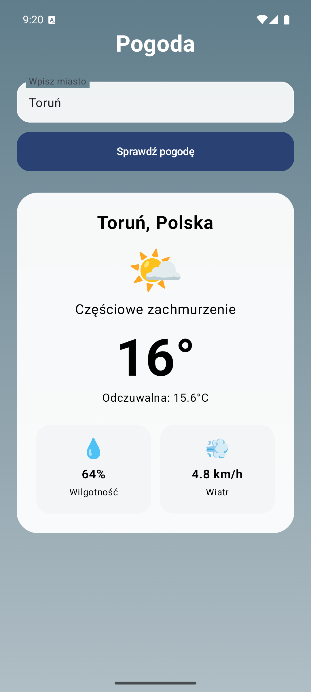

# PogodaApp

Natywna aplikacja pogodowa na Androida napisana w **Kotlinie** z wykorzystaniem **Jetpack Compose**.

Aplikacja pozwala wyszukać miasto i pobrać aktualne dane pogodowe z API Open-Meteo.

## Funkcje

- wyszukiwanie pogody po nazwie miasta
- aktualna temperatura
- temperatura odczuwalna
- wilgotność
- prędkość wiatru
- opis warunków pogodowych
- dynamiczne tło zależne od pogody
- obsługa ładowania i błędów

## Technologie

- Kotlin
- Android SDK
- Jetpack Compose
- ViewModel
- Kotlin Coroutines
- REST API
- JSON
- Open-Meteo API

## Architektura

Projekt został podzielony na proste warstwy:

- `MainActivity.kt` – interfejs użytkownika w Jetpack Compose
- `WeatherViewModel.kt` – stan ekranu i logika aplikacji
- `WeatherRepository.kt` – komunikacja z API
- `WeatherData.kt` – model danych pogodowych

Przepływ danych:

```text
Jetpack Compose
      ↓
WeatherViewModel
      ↓
WeatherRepository
      ↓
Open-Meteo API
      ↓
WeatherData
      ↓
UI
```

## Screenshot

Dodaj screenshot aplikacji do folderu:

```text
screenshots/pogoda.png
```

GitHub wyświetli go tutaj:



## Uruchomienie

1. Otwórz projekt w Android Studio.
2. Poczekaj na zakończenie Gradle Sync.
3. Uruchom aplikację na emulatorze lub urządzeniu z Androidem.
4. Wpisz nazwę miasta i wybierz **Sprawdź pogodę**.

## Autor

Mateusz Sokołowski
